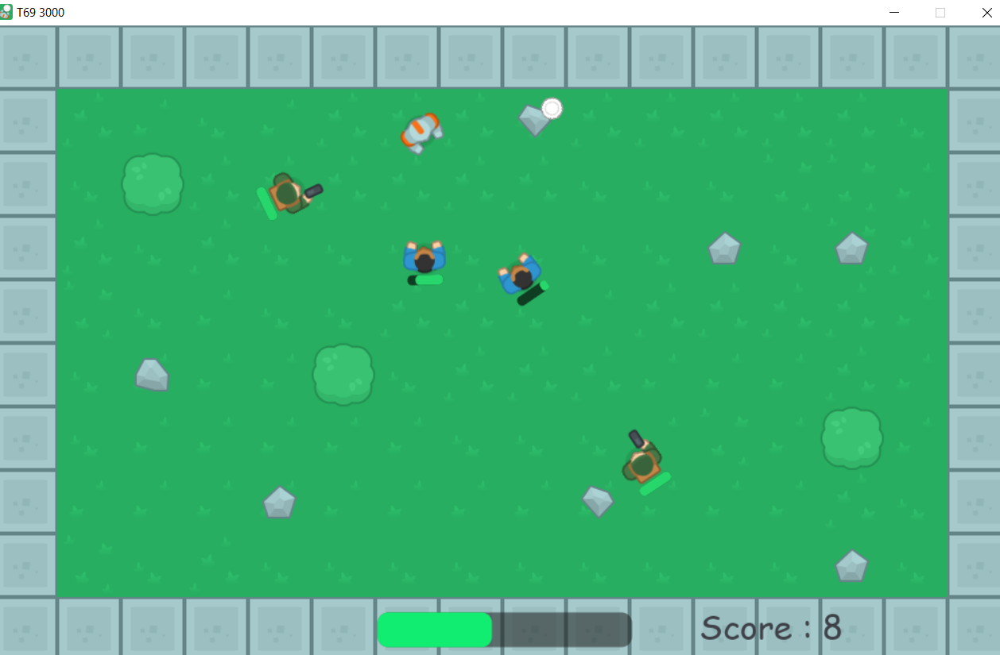

# T69-3000
Game for SUMMER GAME JAM 2021 by GDSIITK

## About Game
You are assigned to test the first working model of T69 blade 3000 in the advance testing facility of Delta Corp, make strategy, fight against AI, experiment with human lookalikes, go crazy with blades

## Controls
* WASD / Arrow keys : Movement
* Click : Shoot blades

## Credits
* Kenney Vleugels (Kenney.nl) for Tilesets
* AlexBeroza for Juno Sound Track
* Morusque for 260809 Funky Nurykabe Sound Track

## Developed by
* Ishan Bawne (Programmer and Leader)
* Aditya Yadav (Artist)

## ScreenShot
